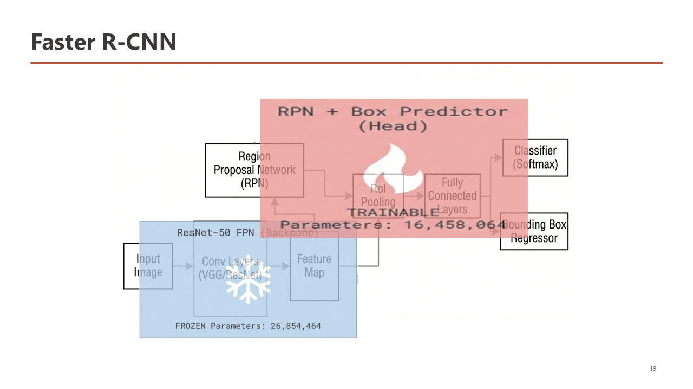
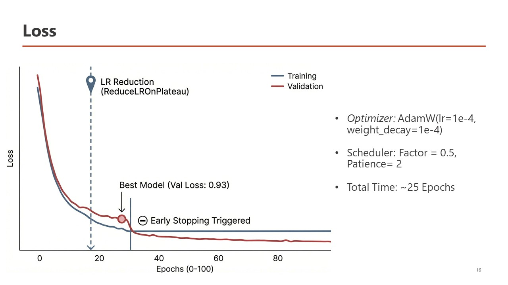
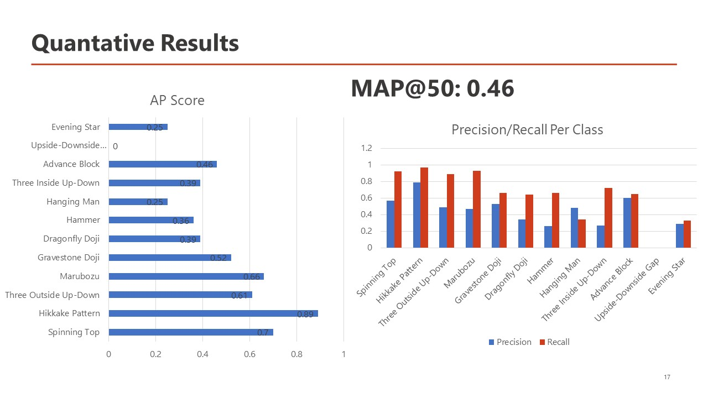

# Scratch Candlestick Pattern Detector

This folder contains our from-scratch candlestick pattern detection experiment. The complete workflow lives in [`scratch_model_early_stopping.ipynb`](scratch_model_early_stopping.ipynb), while the `images` folder contains the diagrams and result figures used to explain the model.

Unlike the other pretrained approaches in the wider project, this detector is built directly in PyTorch. The goal was to understand and control the full detection pipeline—from loading COCO annotations to assigning targets, calculating losses, applying early stopping, and drawing the final predictions.

## What the notebook does

The notebook expects a COCO-style dataset with `train`, `valid`, and `test` folders. Each split must include an `_annotations.coco.json` file. Images and bounding boxes are resized to `512 × 512`, and category IDs are converted to contiguous class IDs automatically.

The model is a compact, anchor-free detector inspired by FCOS:

1. A small residual CNN (`TinyBackbone`) extracts features at strides 8, 16, and 32.
2. A Feature Pyramid Network combines these features into the P3, P4, and P5 levels, each with 128 channels.
3. The detection head predicts class scores, box distances, and centerness at every feature-map location.
4. Center sampling and scale-based regression ranges assign ground-truth boxes to suitable feature levels.



The total training loss combines focal loss for classification, GIoU loss for bounding-box regression, and binary cross-entropy for centerness. The three components are normalized by the number of positive locations.

## Training and early stopping

Training uses AdamW with a learning rate of `1e-4` and weight decay of `1e-4`. A `ReduceLROnPlateau` scheduler halves the learning rate when validation loss stops improving. The run allows up to 100 epochs, but early stopping ends training after eight validation checks without a meaningful improvement (`min_delta = 1e-4`). The notebook saves the weights with the lowest validation loss as `scratch_model_early_stopping.pt`.

In the recorded experiment, the best validation loss was approximately **0.93**, and training stopped after roughly 25–30 epochs instead of running for the full 100.



## Evaluation

During inference, predictions from all pyramid levels are decoded into bounding boxes. Class probability is multiplied by centerness, then class-wise non-maximum suppression removes overlapping detections. The notebook evaluates the test split at an IoU threshold of 0.50 using 11-point interpolated average precision.

The recorded test result was **mAP@50 = 0.46** across 12 candlestick-pattern classes. Performance varied considerably by class: Hikkake Pattern achieved the strongest AP in the saved results, while the Upside-Downside Gap class received an AP of zero. These results should be treated as a baseline for a lightweight model trained from scratch, not as a production benchmark.



## Running the notebook

The notebook was written for Google Colab and currently uses Google Drive paths. Before running it, update these two locations:

```python
root_path = Path("/content/drive/MyDrive/coco_dataset")
save_dir = "/content/drive/MyDrive/model"
```

Run the cells from top to bottom. A CUDA-capable GPU is strongly recommended because the configured batch size is 64. If memory is limited, reduce the batch size in the three `DataLoader` definitions. The main dependencies are Python, PyTorch, torchvision, Pillow, NumPy, Matplotlib, and tqdm.

The saved `.pt` file contains the best model's `state_dict`. To load it later, recreate the detector with the same number of classes and architecture settings before calling `load_state_dict`.

## Image folder

The figures in `images/` document the experiment:

- `Architecture.JPG` — full detector overview
- `Backbone.JPG` — residual CNN feature extractor
- `FPN.JPG` — multi-scale feature pyramid
- `Detection_Head.JPG` — classification, regression, and centerness branches
- `Pipeline.JPG` — end-to-end data and detection workflow
- `loss.JPG` — training behavior, learning-rate reduction, and early stopping
- `Inference.JPG` — prediction decoding and filtering process
- `Results.JPG` — AP, precision, recall, and overall mAP@50

These images are supporting documentation for this notebook and can be viewed independently without running the model.
