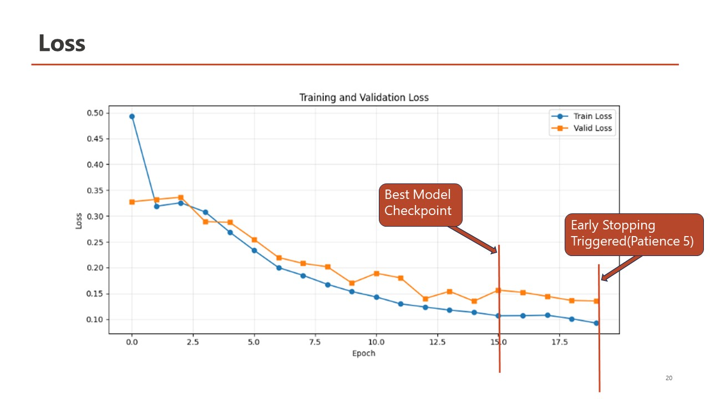
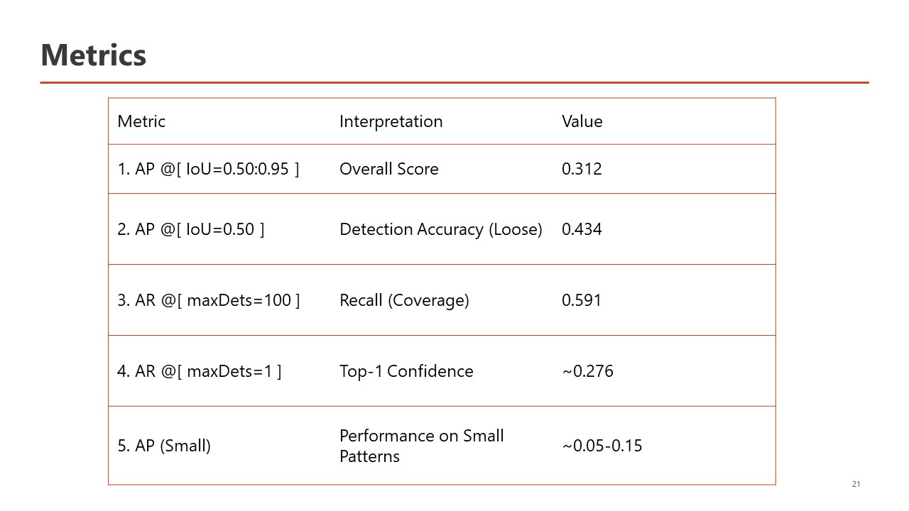
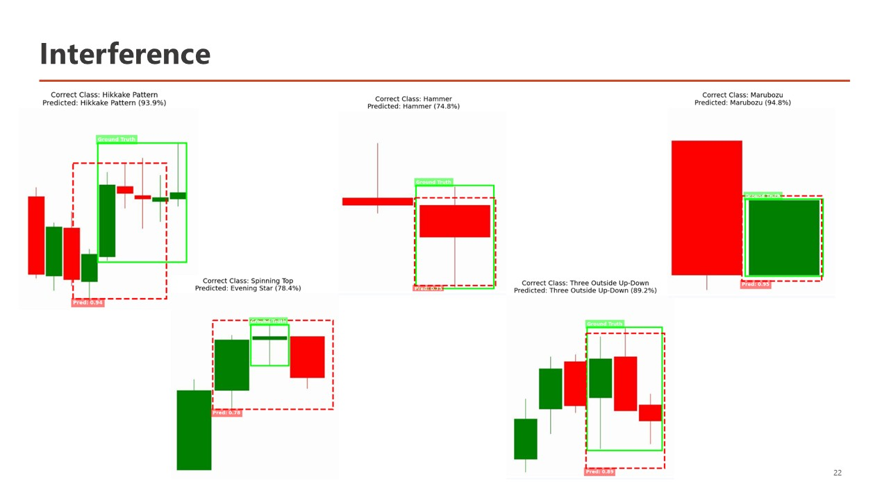

# Faster R-CNN Candlestick Pattern Detector

This folder contains the Faster R-CNN experiment used to detect candlestick chart patterns. The work is kept in one Google Colab notebook, [`FasteRCNN.ipynb`](./FasteRCNN.ipynb), with the main training and evaluation figures stored in [`images`](./images).

The model treats the problem as object detection rather than whole-image classification. This means it can find a pattern inside a chart, draw a bounding box around it, and assign the detected pattern a confidence score.

## Model overview

The notebook fine-tunes `fasterrcnn_resnet50_fpn_v2` from Torchvision. It starts with pretrained weights, freezes the ResNet-50 feature-extraction backbone, and replaces the final box predictor with a new predictor sized for the candlestick classes in the dataset. An additional class is reserved for the background.


The dataset is read in COCO detection format. During training, brightness, contrast, and color augmentations are applied with Albumentations. The notebook also uses a weighted sampler to give examples containing less common patterns a better chance of being selected.

Training uses AdamW, mixed precision, a learning-rate scheduler, and early stopping. The run is configured for up to 30 epochs, but training stops when validation loss no longer improves for five checks.

## Expected dataset layout

The notebook expects a dataset folder with three splits:

```text
coco_top_12_cls/
|-- train/
|   |-- _annotations.coco.json
|   `-- image files...
|-- valid/
|   |-- _annotations.coco.json
|   `-- image files...
`-- test/
    |-- _annotations.coco.json
    `-- image files...
```

Each annotation file must use COCO bounding-box annotations. Category IDs should be consistent across the training, validation, and test splits.

## Running the notebook

Open `FasteRCNN.ipynb` in Google Colab and run the cells from top to bottom. The notebook installs `pycocotools` and `albumentations`, mounts Google Drive, and currently looks for the dataset at:

```text
/content/drive/MyDrive/colab_data/coco_top_12_cls
```

If your data is somewhere else, change `root` or `data_path` in the dataset configuration section. The saved-model paths also point to:

```text
/content/drive/MyDrive/colab_runs/FasteRCNN_model/
```

The recorded setup used a CUDA GPU with a batch size of 128 and 12 data-loader workers. These values are demanding, so reduce `BATCH_SIZE` and `NUM_WORKERS` if Colab runs out of memory or the loader becomes unstable. CUDA is required by the notebook's current mixed-precision configuration.

## Recorded results

The saved notebook run stopped after epoch 20. Its best validation loss was **0.1350**.



Evaluation uses COCO bounding-box metrics with a confidence threshold of 0.50. The main test results were:

| Metric | Score |
| --- | ---: |
| AP at IoU 0.50-0.95 | 0.312 |
| AP at IoU 0.50 | 0.434 |
| AP at IoU 0.75 | 0.371 |
| AR at IoU 0.50-0.95, max 100 detections | 0.591 |



The notebook also compares the ground-truth boxes with model predictions. Predicted boxes are filtered by confidence before they are drawn.



## Files in this folder

- `FasteRCNN.ipynb` contains dataset loading, augmentation, model creation, training, evaluation, visualization, and checkpoint saving.
- `images/Architecture.JPG` shows the model architecture.
- `images/Loss.JPG` shows training and validation loss.
- `images/Metrics.JPG` contains the COCO evaluation output.
- `images/Inference.JPG` shows example detections.

The trained `.pt` weights and the COCO dataset are not included here; they must be supplied separately through the Google Drive paths used in the notebook.
